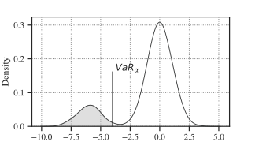
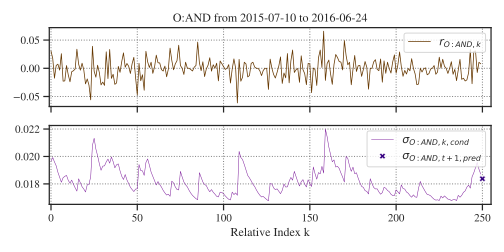
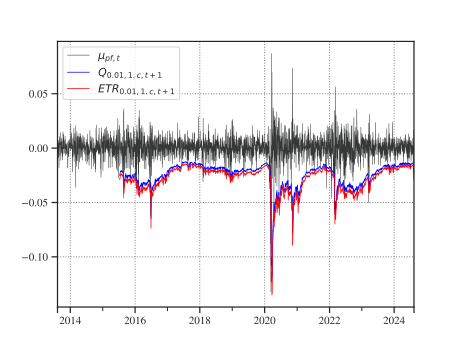
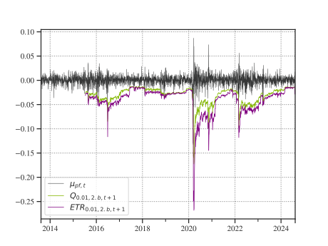
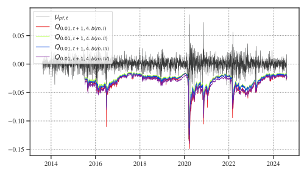
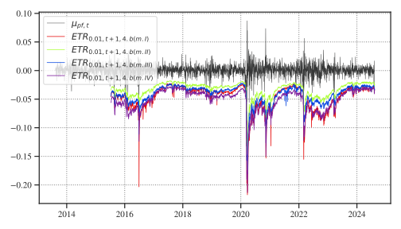
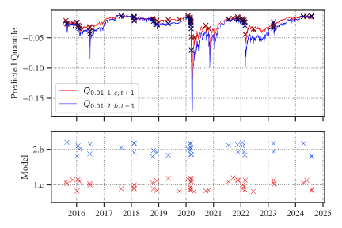
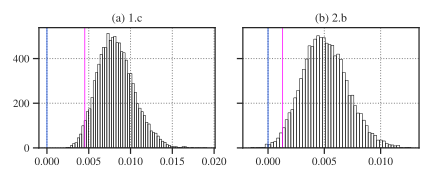

# An Evaluation of the Accuracy of Copula Models for Portfolio Value-at-Risk and Expected Shortfall
*A Comparative Analysis of Gaussian and t Copula Models for Market Risk Estimates for the ATX*
<br>
<br>
by <br>
Marcus Steinbacher
<br>
<br>
[]()
<br>

**Abstract** <br>
I evaluate one-day ahead Value-at-Risk (VaR) and Expected Shortfall (ES) using various models, including two benchmark models, Variance-Covariance and Historical Simulation, and two families of Copula-based methods: Gaussian and Student t 
copula models. To account for heteroskedasticity all models are applied to GARCH(1,1) volatility-adjusted daily log-returns of an equally weighted ATX portfolio 
between 2013 and 2024.
The Variance-Covariance model, while computationally efficient, assumes normality which may not hold for financial returns and Historical Simulation provides decent 
VaR estimates but struggles with extreme events out-of-sample.
Copula models on the other hand offer flexibility in capturing dependencies, with t-copula models showing superior performance in extreme market conditions. Backtesting shows, that particularly when paired with Student t-parametrized margins these models yield tail-heavy returns and thus do not tend to systematically underestimate the ES.
The study also evaluates the computational efficiency of different models. Method-of-moments (MoM) calibrated copula models outperform their maximum-likelihood 
estimated (MLE) counterparts, especially with high-dimensional data, without sacrificing accuracy.
<br>
<br>
**Keywords**: Copula, VaR, ES, GARCH
<br>

## 1 Introduction
In the realm of financial economics, understanding the complex interdependencies between multiple asset returns is crucial for effective portfolio management, risk assessment, and hedging (Mashal & Zeevi, 2002), to name just a few. Traditional methods for modelling asset return often rely on multivariate normal distributions, which cannot adequately capture the true nature of financial data, especially in the presence of extreme events and asymmetric relationships (see e.g. Embrechts et al., 2001). <br>
Furthermore, simple correlation is rather limited in displaying the actual underlying dependencies (Mashal & Zeevi, 2002). These limitations have driven researchers and practitioners to explore more flexible approaches that can better account for the inherent dependence structures among asset returns.
Copula functions have emerged as a powerful tool for modelling multivariate distributions by separating the modelling of marginal behavior from the modelling of dependence structures. This flexibility allows for a more accurate representation of the joint distribution of asset returns, accommodating non-linear dependencies and tail correlations that are often observed in financial markets.
A growing body of scientific literature supposes copula methods as elgant approaches for the estimation of (one-day ahead) market risk metrics.
The so-called market risk is of crucial concern for financial institutions hence it encompasses the potential for change in the value of a financial position due to fluctuations in the price of the underlying components (see McNeil et al., 2015). One of the most effective and widespread tools for quantifying market risk is the so-called Value-at-Risk (VaR), an estimate of the maximum potential loss over a given time frame associated with a specified confidence level (see Nadarjah & Chan in Longin, 2017). <br>
From a mathematical point of view this is a simple “quantile of the profit-and-loss (P&L) distribution of a given portfolio over a prescribed holding period” (McNeil & Frey, 2000).
Although its conceptual simplicity and ease of computation made VaR the usual financial risk measure, Artzner et al. (1999) indicate some major theoretical deficiencies
of the concept, first and foremost that it disregards any losses beyond the specified level $\alpha$, a circumstance referred to as ‘tail risk’ (see Yamai & Yoshiba, 2005).
 <br>

**Figure 1**: A visual representation of the tail-risk associated with an $\alpha$-level VaR of an aribtrary distribution of portfolio returns.

A preferred *coherent* risk metric that tries to overcome these disadvantages, particularly considering extreme events (see Tasche 2002), is the so-called Expected Shortfall (ES), also known as conditional VaR (CVaR). The term describes the expected loss under the condition of a loss event, i.e. a return realization beyond the $\alpha$-level VaR (see Figure 1, grey). For a random variable $X$, i.e. daily portfolio returns, we denote,

```math
ES_{\alpha} = E[X|X \lt VaR_{\alpha}]
```

Finally, VaR and ES are backtestet using several statistical tests.
This study is organized in several modules: The `models` module contains classes and functions for the different resolution methods, e.g. *Historical Simulation*, *t-Copula Simulation*, etc., the module `backtests` implements different statistical tests for backtesting VaR and ES, and the module `tools` contains frequently used helper functions. The fundamental data used is prepared in `data`.

## 2 GARCH(1,1) Adjusted Returns
To account for the heteroskedasticity of financial time series all models are based upon volatility-adjusted daily log-returns $\tilde{r}_t$, where each return an a roling window of 250 trading days is adjusted to the current level of volatility,

```math
\tilde{r}_t = \frac{\sigma_{T}}{\sigma_t}  r_{t}
```

where $T$ is the relative index at the end of each window and the time series $\sigma$ is a series of GARCH(1,1) volatility foecasts based on the last 250 log-returns `df_sigma_pred`.<br>

```python
from data.data import df_tr_log
from models.Garch import garch_vol
from tqdm import tqdm
from concurrent.futures import ProcessPoolExecutor

df_sigma_pred = pd.DataFrame()
tickers = df_tr_log.columns

def func(ticker):
    return ticker, df_tr_log.loc[:,ticker].rolling(250,closed="left").apply(garch_vol)

#Parallel
with ProcessPoolExecutor() as p:
    for ticker,res in tqdm(p.map(func,tickers),total=len(tickers)):
        df_sigma_pred.loc[:,ticker] = res
```

Figure 2 (top) displays an arbitrary window of 250 daily log-returns, Figure 2 (bottom) shows the GARCH(1,1) conditional volatilty as well as the one-period volatility forecast for an arbitrary asset and window.


**Figure 2**: GARCH(1,1) volatility forecast in a window of 250 daily log-returns. <br>

## 3 Models
To derive next-day VaR and ES forecast all models are applied to rolling windows of 250 volatility-adjusted portfolio returns `adj_return_windows`. <br>
With the previously calculated time series of predicted volatilities `df_sigma` and the series of daily log-returns `df_r`, these windows are,

```python
from numpy.lib.stride_tricks import sliding_window_view

df_r = pd.read_pickle("data/df_tr_log_red.pkl")
df_sigma = pd.read_pickle("data/df_sigma_pred.pkl")

#Dividing into windows
r_windows = sliding_window_view(df_r,(250,20)).squeeze(1)
sigma_windows = sliding_window_view(df_sigma,(250,20)).squeeze(1)

#Adjustment Fatcors
adj_factor_windows = np.array([window[-1]/window for window in sigma_windows])

#Adjusted Returns
adj_return_windows = r_windows*adj_factor_windows
```
### 3.1 Variance-Covariance
The linear-parametric variance-covariance model, called *1.c*, assumes that asset returns are multivariate normally distributed and is built upon the assumption of constant portfolio standard deviation. <br>
The day-ahead VaR expressed as a simple $\alpha$-quantile of portfolio return observations $Q_\alpha$ is given by,

```math
Q_{\alpha,t+1} = \mu_{pf,t} +\sigma_{pf,t} \Phi^{-1}(\alpha) 
```

where $\mu_{pf,t}$ and $\sigma_{pf,t}$ are the day-*t* expected portfolio return and standard deviation, and $\Phi^{-1}(\alpha)$ is the standard normal $\alpha$-quantile.

```python
from models.VarianceCovariance import quantile
from data.data import adj_return_windows

#Expected Portfolio Return 1%-Quantile
quantiles = [quantile(window) for window in adj_return_windows]
```

For the next-day ES, expressed as the expected return below the $\alpha$-quantile $ETR_\alpha$, I denote,

```math
ETR_{\alpha,t+1} =\frac{1}{\alpha} \int_{-\infty}^{Q_{\alpha,t+1}} x f(x)dx
```
<br>

```python
from models.VarianceCovariance import expected_shortfall

etrs = [expected_shortfall(window) for window in adj_return_windows]
```
Both the series of `quantiles` and `etrs` must be aligned with the realized daily portfolio returns as of `tools.Portfolio.mu`. Figure 3 shows the one-day ahead portfolio return 1%-quantiles *Q* (blue) as well as the expected tail returns beyond the 1%-level *ETR* (red) versus the realized daily portfolio returns (black).


**Figure 3**: Model 1.c one day-ahead 1%-quantile and expected tail return versus realized portfolio returns.

### 3.2 Historical Simulation
The second benchmark model (*2.b*) is a simple historical simulation approach where I estimate the day-ahead VaR as empirical quantile of the last 250 adjusted portfolio return observations in a rolling window manner for each window in `data.data.adj_return_windows`.
The natural estimator for the ES is simply given by the arithmetic mean of the worst 1% observations in each window.

```python
from models.HistoricalSimulation import quantile, expected_shortfall

[...]
```
A comparison of the day-ahead 1%-quantile *Q* (green) and expected tail return *ETR* (purple) is presented in Figure 4.


**Figure 4**: Model 2.b one day-ahead 1%-quantile and expected tail return versus realized portfolio returns.

### 3.3 Copula Models
Using `models.Copulae` one can evaluate gaussian as well as t copula models. The module in its core functionality is a wrapper around the powerful R `copula` package. <br>
I've added more flexibility towards the modelling of the margin distributions. Table 1 describes the currently implemented margin strategies.<br>

**Table 1**: Brief description of the several margin models.
|Name|Brief Description|
|----|-----------------|
|m.I| Empricial margins based on the empirical CDF|
|m.II| Normal margins with a MLE of $\mu$ and $\sigma$|
|m.III| Student t margins with a MLE of location, scale and degree-of-freedom parameters |
|m.IV| Like m.III but wit a degree-of-freedom fixed to $\nu=3$

To estimate the one-day ahead 1%-quantile and expected tail return I calibrate (`.fit(*args,**kwargs)`) a copula on each of the windows and draw *n* random vectors. Once a copula object is fitted with data one can draw random samples (`.predict_[...](*args,**kwargs)`) to calculate the portfolio returns and the desired 1%-quantile/expected-tail-return. <br>
Here is a quick example of a method-of-moments calibration of a t-copula with Student t-margins with a fixed degree-of-freedom parameter $\nu=3$, called model *4.b(m.IV)*.

```python
from models.Copulae import tCopulaSimulation
from data.data import adj_return_windows
from tools.Portfolio import mu as mu_pf

# Example: One arbitrary window
window = adj_return_windows[251]

# Method-of-moments calibration (fit) with degree-of-freedom copula parameter = 3
copula = tCopulaSimulation(dispstr="un",df=3,df_fixed=True)
copula.fit(window, method="itau")

# Drawing 1e6 random vectors, adding their antithetic variates and model the margins as Student t-distributed with \nu=3
prediction = copula.predict_parametric(1e6,anti=True,distribution="t",f0=3)

# Calculate portfolio returns, 1%-quantile and expected-tail-return
mu_pf_pred = mu_pf(prediction)

q = np.quantile(mu_pf_pred,0.01)

etr = np.mean(mu_pf_pred, where=mu_pf_pred<q)
```

Applying the procedure above to all 250-trading-day windows in `data.data.adj_return_windows` results in a series of one-day ahead quantile *Q* estimates (see Figure 5).



**Figure 5**: Day-ahead 1% portfolio return quantiles for t copula based models with different margin strategies.

The same applies for the next-day expected-tail-returns *ETR*.



**Figure 6**: Day-ahead 1% portfolio expected tail returns for t copula based models with different margin strategies.

## 4 Backtests
The module `backtests` implements several statistical tests for the VaR and the ES. 
**VaR** is backtested using a simple Kupiec (1995) proportion-of-failure (POF) test, an Christofferson (1998) test for independence and a combined VaR-test. <br>
Figure 7 compares the VaR simple hits yielded by the Variance-Covariance model *1.c* and the Historical Simulation model *2.b*.



**Figure 7**: Variance-Covariance (1.c) and Historical Simulation (2.b) simple hits.

```python
from backtests.Backtest import simple_hits, VaRTest

mu_pf = pd.read_pickle("data/mu_pf.pkl")
var_hist = pd.read_pickle("data/var_hist_v2.pkl")

# Evaluating the proportion of hits for the Historical Simulation model 2.b
hits = simple_hits(mu_pf,var_hist)
pof = sum(hits)/len(hits)
print(pof)
```
```
> 0.014345991561181435
```
```python
# Conducting the combined VaR test for the Historical Simulation model 2.b
test_results = VaRTest(0.01,mu_pf,var_hist,0.99)
print(test_results)
```
```
> expected.exceed                               23.0
actual.exceed                                   34.0
uc.H0                            Correct Exceedances
uc.LRstat                                   3.985495
uc.critical                                 6.634897
uc.LRp                                      0.045894
uc.Decision                        Fail to Reject H0
cc.H0              Correct Exceedances & Independent
cc.LRstat                                  30.980433
cc.critical                                  9.21034
cc.LRp                                           0.0
cc.Decision                                Reject H0
```

**ES** is backtested with an one-sided bootstrapping test under the null hypothesis that the mean of the residuals of realized portfolio returns and expected tail returns on hit-days is (less than) zero (see McNeil & Frey, 2000). In other words, if the mean of these residuals is significantly greater then zero the model tends to systematically underestimate the ETR.

```python
from scipy.stats import bootstrap
from backtests.Backtest import residuals

es_hist = pd.read_pickle("data/es_hist_v2.pkl")

obs = residuals(mu_pf,var_hist,es_hist)

statistic = lambda a: np.mean(a)
test_result = bootstrap((obs,),statistic,confidence_level=0.99,alternative="greater")
```
Conducting this bootstrapping test for example for model *1.c* **and** model *2.b* results in Figure 8.



**Figure 8**: Zero-mean residual bootstrapping test for the Variance-Covariance model *1.c* and the Historical Simulation *2.b*.

We see that for both models the hypothesized value 0 lies outside the specified confidence interval thus indicating a systemtically underestimated ES.

## References
Artzner, P., Delbaen, F., Eber, J.M., Heath, D. (1999). Coherent Measures of Risk, Mathematical Finance, 9(3), pp. 203–228.

Christofferson P.F. (1998). Evaluating Interval Forecasts, International Economic Review, 39(4), pp. 841-862.

Embrechts, P., Lindskog, F., McNeil, A.J. (2001). Modelling dependence with copulas, Rapport technique 14, Département de mathématiques, Institut Fédéral de Technologie de Zurich, pp. 1-50. 

Kupiec, P.H. (1995). Techniques for verifying the accuracy of risk measurement models, The Journal of Derivatives 3(2), pp. 73-84.

Mashal, R., Zeevi, A. (2002). Beyond Correlation: Extreme Co-Movements be-tween Financial Assets, Working paper. Available at SSRN: https://ssrn.com/abstract=317122 

McNeil, A.J., Frey, R. (2000). Estimation of Tail-Related Risk Measures for Heter-oscedastic Financial Time Series: An Extreme Value Approach, Journal of Empiri-cal Finance, 7(3-4), pp. 271-300.

McNeil, A.J., Frey, R., Embrechts, P. (2015). Quantitative Risk Management. Concepts, Techniques and Tools, Revised edition, Princeton University Press, Prince-ton and Oxford.

Nadarajah, S., Chan, S. (2017). Estimation Methods for Value at Risk. In: Longin, F. (eds.). Extreme Events in Finance: A Handbook of Extreme Value Theory and its Applications, John Wiley & Sons, New Jersey.

Tasche, D. (2002). Expected shortfall and beyond. Journal of Banking & Finance, 26, pp. 1519–1533.

Yamai, Y., Yoshiba, T., (2005). Value-at-risk versus expected shortfall: A practical perspective, Journal of Banking & Finance 29, pp. 997–1015.
